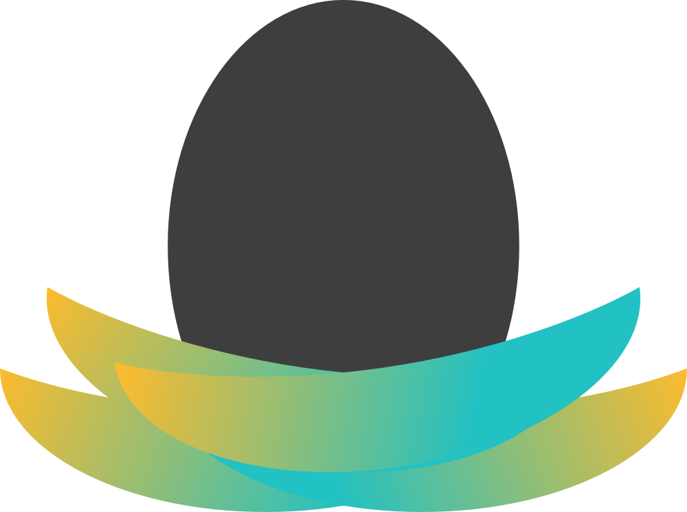

 

  

  <h3 align="center">nest.land - Standard Modules</h3>

  

    A decentralized mirror of Deno's Standard Modules
  

> This is a mirror of Deno's Standard Modules. The code itself is not maintained, modified, or updated by nest.land. New versions are published when they are released by Deno.

# Deno Standard Modules

These modules do not have external dependencies and they are reviewed by the
Deno core team. The intention is to have a standard set of high quality code
that all Deno projects can use fearlessly.

Contributions are welcome!

## How to use

These modules will eventually be tagged in accordance with Deno releases but as
of today we do not yet consider them stable and so we version the standard
modules differently from the Deno runtime to reflect this.

It is strongly recommended that you link to tagged releases to avoid unintended
updates and breaking changes.

Don't link to / import any module whose path:

- Has a name or parent with an underscore prefix: `_foo.ts`, `_util/bar.ts`.
- Is that of a test module or test data: `test.ts`, `foo_test.ts`,
  `testdata/bar.txt`.

Don't import any symbol with an underscore prefix: `export function _baz() {}`.

These elements are not considered part of the public API, thus no stability is
guaranteed for them.

## Contributing

deno_std is a loose port of [Go's standard library](https://golang.org/pkg/).
When in doubt, simply port Go's source code, documentation, and tests. There are
many times when the nature of JavaScript, TypeScript, or Deno itself justifies
diverging from Go, but if possible we want to leverage the energy that went into
building Go. We generally welcome direct ports of Go's code.

Please ensure the copyright headers cite the code's origin.

Follow the [style guide](https://deno.land/manual/contributing/style_guide).
